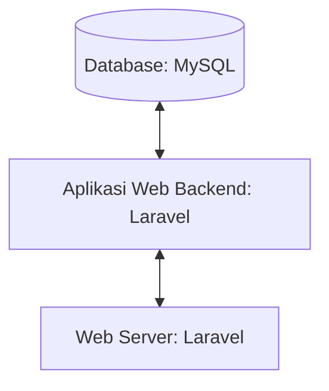

## 1.1 Latar Belakang

Saya membuat website ini berawal dari keingin saya yang ingin memiliki sepatu air jordan 

## 1.2. Deksripsi Teknologi Informasi

Aplikasi ini digunakan untuk membeli sepatu yang di khusus kan untuk sepatu nike air jordan

## 1.3. Branding

Merk : Ditzz

Tagline :"Improve Your Style"

Campaign : Membuat website sederhana yang bisa di akses kapanpun tanpa harus berpergian

Target user :
 - usia 13+
 - pengoleksi sepatu jordan
 - pecinta sepatu
 - penggemar olahraga basket
 - pemeberi hadiah
 - starboy
 - pengemar atlet yang memkai seaptu jordan
 - atlit
 - pembeli yang ingin meningkatkan gaya
 - pembeli gabut yang memeliki banyak uang

 User Experience Theme :
  - mudah
  - jelas
  - sederhana
  - cepat
  - nyaman
  - warna : yang identik dengan Bandung yaitu Biru(Persib)
  - Reverensi website
   

## 2. User Story

sebagai| saya ingin bisa | sehingga | prioritas
---|---|---|---
Admin | Hapus Product | Bisa menghapus product | ⭐⭐⭐⭐⭐
Admin | Mengelola data transaksi  | Bisa melihat detail transaksi dan mengubah status transaksi | ⭐⭐⭐⭐⭐
Admin | Mengelola data user | Bisa update data user dan menghapus data user | ⭐⭐⭐⭐⭐
Admin | Upload Product | Banyak product yang bisa dipilih user  | ⭐⭐⭐⭐⭐
Admin | Edit Product | Bisa merubah harga, deskripsi, nama product | ⭐⭐⭐⭐⭐
pengguna | melihat semua product | banyak pilihan produck | ⭐⭐⭐
pengguna | memasukan ke dalam keranjang | dapat melist product sebelum check out | ⭐⭐⭐⭐
pengguna | melihat detail product | melihat deskrips lengkap product | ⭐⭐⭐⭐
pengguna | chat dengan admin | agar memperjelas deskripsi atau pertanyaan yang diajukan customer| ⭐⭐⭐⭐⭐
pengguna | memilih media pembayaran | bisa menyesuaikan payment yang di punya | ⭐⭐⭐⭐⭐
Pengguna | Membuat dan melihat ulasan product| Dapat membuat keputusan yang didasarkan pada pengalaman pelanggan lain | ⭐⭐⭐

## 3. Struktur Data

## 4. Arsitektur Sistem

## 5. Teknologi, Library, dan Framework
- UI/UX Design : Figma
- Browser : Chrome
- Text Editor : VS Code
- Framework :
-
-
-

## 6. Desain User Experience dan User Interface

Landing Page 

## 7. Demonstrasi Video

Link youtube nya

## 8. Bagaimana mesin komputasi dan sistem operasi berperan dalam produk teknologi informasimu ?

Link youtube nya di detik jawaban ini

## 9. Bagaimana algoritma, struktur data, dan bahasa pemrograman berperan dalam produk teknologi informasimu ?

Link youtube nya di detik jawaban ini

## 10. Bagaimana metode pengembangan perangkat lunak / Software Development Life Cycle berperan dalam produk teknologi informasimu ?

Link youtube nya di detik jawaban ini

## 11. Bagaimana database / sistem basis data berperan dalam produk teknologi informasimu ?

Sebuah database adalah kumpulan data yang tersimpan dalam sistem yang terstruktur, dirancang untuk pengelolaan dan akses data yang efisien. Ini berfungsi sebagai penyimpanan terorganisir yang memungkinkan Anda untuk menyimpan, mengakses, dan mengelola informasi dengan cara yang terstruktur dan mudah diakses."

Sebagai contoh saya akan menjelas kan rancangan database yang saya buat

