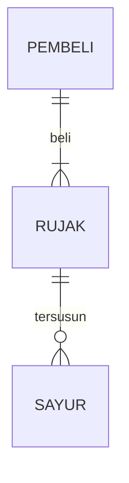

## 1.1 Latar Belakang

bla bla bla

## 1.2. Deksripsi Teknologi Informasi

Aplikasi ini digunakan untuk membeli sepatu yang di khusus kan untuk sepatu nike air jordan

## 1.3. Branding

bla bla bla

## 2. User Story

sebagai| saya ingin bisa | sehingga | prioritas
---|---|---|---
pengguna | melihat semua product | banyak pilihan produck | ⭐⭐⭐⭐
pengguna | memasukan ke dalam keranjang | dapat melist product sebelum check out | ⭐⭐⭐⭐
pengguna | melihat detail product | melihat deskrips lengkap product | ⭐⭐⭐⭐
pengguna | chat dengan admin | agar memperjelas deskripsi atau pertanyaan customer| ⭐⭐⭐⭐⭐
pengguna | memilih media pembayaran | bisa menyesuaikan payment yang di punya | ⭐⭐⭐⭐⭐

## 3. Struktur Data

Cara membuat aneka macam bentuk grafik menggunakan mermaid.js bisa lihat di [https://mermaid.js.org/syntax/entityRelationshipDiagram.html](https://mermaid.js.org/syntax/entityRelationshipDiagram.html) 

## 4. Arsitektur Sistem

Masih pake mermaid.js juga bisa lihat flowchart di [https://mermaid.js.org/syntax/flowchart.html](https://mermaid.js.org/syntax/flowchart.html)

## 5. Teknologi, Library, dan Framework

bla bla bla

## 6. Desain User Experience dan User Interface

Bisa load image 

## 7. Demonstrasi Video

Link youtube nya

## 8. Bagaimana mesin komputasi dan sistem operasi berperan dalam produk teknologi informasimu ?

Link youtube nya di detik jawaban ini

## 9. Bagaimana algoritma, struktur data, dan bahasa pemrograman berperan dalam produk teknologi informasimu ?

Link youtube nya di detik jawaban ini

## 10. Bagaimana metode pengembangan perangkat lunak / Software Development Life Cycle berperan dalam produk teknologi informasimu ?

Link youtube nya di detik jawaban ini

## 11. Bagaimana database / sistem basis data berperan dalam produk teknologi informasimu ?

Link youtube nya di detik jawaban ini
